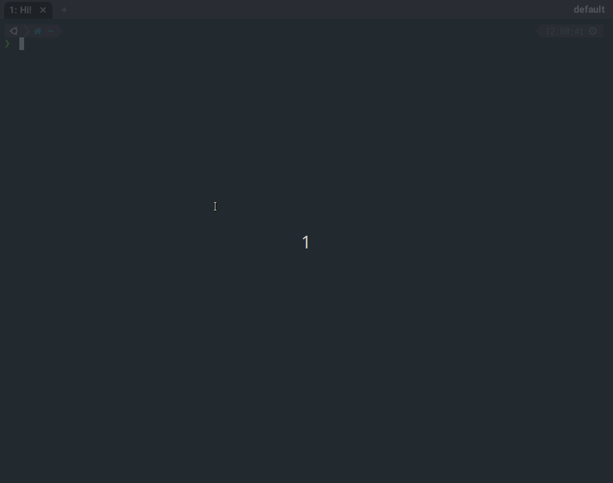

# wezterm-cmdpicker

A WezTerm plugin that provides a command-palette-style fuzzy picker for keybindings. Press a trigger key (default: `LEADER+Space`) to get an InputSelector popup listing all your keybindings.



## Features

- **Fuzzy search** across all keybindings
- **3-layer discovery**: registered bindings (with descriptions) → config keybindings (auto-discovered) → WezTerm defaults
- **No re-definition needed**: bindings added directly to `config.keys` are automatically picked up
- **Deduplication**: overridden defaults are hidden
- **Colored labels**: registered bindings highlighted, defaults dimmed
- **Action-only commands**: register commands without keybindings (e.g., SSH servers) — searchable in the picker

## Installation

Require the plugin in your `wezterm.lua`:

```lua
local cmdpicker = wezterm.plugin.require('https://github.com/abidibo/wezterm-cmdpicker')
```

For local development:

```lua
local cmdpicker = wezterm.plugin.require('file:///home/you/path/to/wezterm-cmdpicker')
```

## Usage

### Inline keybindings (single file config)

```lua
local wezterm = require('wezterm')
local act = wezterm.action
local config = wezterm.config_builder()

local cmdpicker = wezterm.plugin.require('https://github.com/abidibo/wezterm-cmdpicker')

-- Option A: Define keybindings through the plugin (adds to config.keys + registers with desc)
cmdpicker.add_keys(config, {
  { key = 'n', mods = 'LEADER', action = act.SpawnTab('CurrentPaneDomain'), desc = 'New tab' },
  { key = 'x', mods = 'LEADER', action = act.CloseCurrentPane({ confirm = true }), desc = 'Close pane' },
  { key = 'z', mods = 'LEADER', action = act.TogglePaneZoomState, desc = 'Toggle zoom' },
})

-- Option B: Define keybindings normally — they'll still appear in the picker (auto-described)
table.insert(config.keys, { key = 'f', mods = 'LEADER', action = act.ToggleFullScreen })

-- Option C: Register bindings from another plugin (already in config.keys elsewhere)
cmdpicker.register({
  { key = 's', mods = 'LEADER', action = act.SplitVertical({ domain = 'CurrentPaneDomain' }), desc = 'Split vertical' },
})

-- Apply picker trigger (LEADER+Space by default) — call this LAST
cmdpicker.apply_to_config(config, {
  title = 'Command Palette',
})

config.leader = { key = 'a', mods = 'CTRL', timeout_milliseconds = 1000 }
return config
```

### Separate keybindings file

If you define keybindings in a separate file that returns a keys list:

```lua
-- keybindings.lua
local wezterm = require('wezterm')
local act = wezterm.action

local keys = {
  { key = 'h', mods = 'LEADER', action = act.SplitHorizontal({ domain = 'CurrentPaneDomain' }), desc = 'Split horizontal' },
  { key = 'v', mods = 'LEADER', action = act.SplitVertical({ domain = 'CurrentPaneDomain' }), desc = 'Split vertical' },
  { key = 'n', mods = 'LEADER', action = act.ActivateTabRelative(1) },  -- desc is optional
}

return keys
```

```lua
-- wezterm.lua
local wezterm = require('wezterm')
local config = wezterm.config_builder()
local cmdpicker = wezterm.plugin.require('https://github.com/abidibo/wezterm-cmdpicker')

config.keys = require('keybindings')
cmdpicker.add_keys(config.keys)

-- Apply picker trigger — call this LAST
cmdpicker.apply_to_config(config, { title = 'Command Palette' })

config.leader = { key = 'a', mods = 'CTRL', timeout_milliseconds = 1000 }
return config
```

## API

### `cmdpicker.register(bindings)`

Register bindings with descriptions for the picker. Accepts a single table or a list of them.

Does **not** add to `config.keys` — use this when bindings are already defined elsewhere (e.g., by another plugin).

The `key` field is optional. Entries without `key` appear as action-only commands in the picker (no keybinding shown, but searchable and executable). This is useful for registering commands like SSH connections:

```lua
local servers = {
  { name = 'Production', host = 'user@prod.example.com' },
  { name = 'Staging', host = 'user@staging.example.com' },
  { name = 'Dev', host = 'user@dev.example.com' },
}

for _, s in ipairs(servers) do
  cmdpicker.register({
    action = act.SpawnCommandInNewTab({ args = { 'ssh', s.host } }),
    desc = 'SSH: ' .. s.name .. ' (' .. s.host .. ')',
  })
end
```

These will appear in the picker when you search "ssh" — no keybinding required.

### `cmdpicker.add_keys(config, bindings)` or `cmdpicker.add_keys(bindings)`

Two calling styles:

**Two-arg form** — adds bindings to `config.keys` AND registers them for the picker:

```lua
cmdpicker.add_keys(config, {
  { key = 'n', mods = 'LEADER', action = act.SpawnTab('CurrentPaneDomain'), desc = 'New tab' },
})
```

**Single-arg form** — registers existing bindings for the picker without modifying `config.keys`. Useful when you define keybindings in a separate file that returns a keys list:

```lua
-- keybindings.lua
local wezterm = require('wezterm')
local act = wezterm.action
local cmdpicker = wezterm.plugin.require('https://github.com/abidibo/wezterm-cmdpicker')

local keys = {
  { key = 'h', mods = 'LEADER', action = act.SplitHorizontal({ domain = 'CurrentPaneDomain' }), desc = 'Split horizontal' },
  { key = 'v', mods = 'LEADER', action = act.SplitVertical({ domain = 'CurrentPaneDomain' }), desc = 'Split vertical' },
  { key = 'n', mods = 'LEADER', action = act.ActivateTabRelative(1) },  -- desc is optional
}

cmdpicker.add_keys(keys)  -- register only, no config object needed
return keys
```

```lua
-- wezterm.lua
config.keys = require('keybindings')
cmdpicker.apply_to_config(config)
```

The `desc` field is optional on each binding. Bindings without `desc` get an auto-generated description from the action.

### `cmdpicker.apply_to_config(config, opts)`

Injects the trigger keybinding into `config.keys`. **Call this after all keybindings are defined.**

Options:

| Option | Default | Description |
|---|---|---|
| `key` | `' '` (Space) | Trigger key |
| `mods` | `'LEADER'` | Trigger modifiers |
| `title` | `'Command Picker'` | InputSelector title |
| `include_defaults` | `true` | Show WezTerm default keybindings |
| `include_key_tables` | `false` | Show default key tables (copy_mode, etc.) |
| `fuzzy` | `true` | Enable fuzzy search |
| `fuzzy_description` | `'Search commands: '` | Fuzzy search prompt text |

## How It Works

The picker assembles choices from three layers:

1. **Registered bindings** (yellow, bold) — added via `register()` or `add_keys()`, shown first with user-provided descriptions
2. **Config bindings** (cyan) — auto-discovered from `config.keys` snapshot taken at `apply_to_config()` time, with auto-generated descriptions
3. **WezTerm defaults** (grey) — from `wezterm.gui.default_keys()`, deduplicated against layers 1 and 2

Selecting a binding executes it via `window:perform_action()`.

## License

MIT
